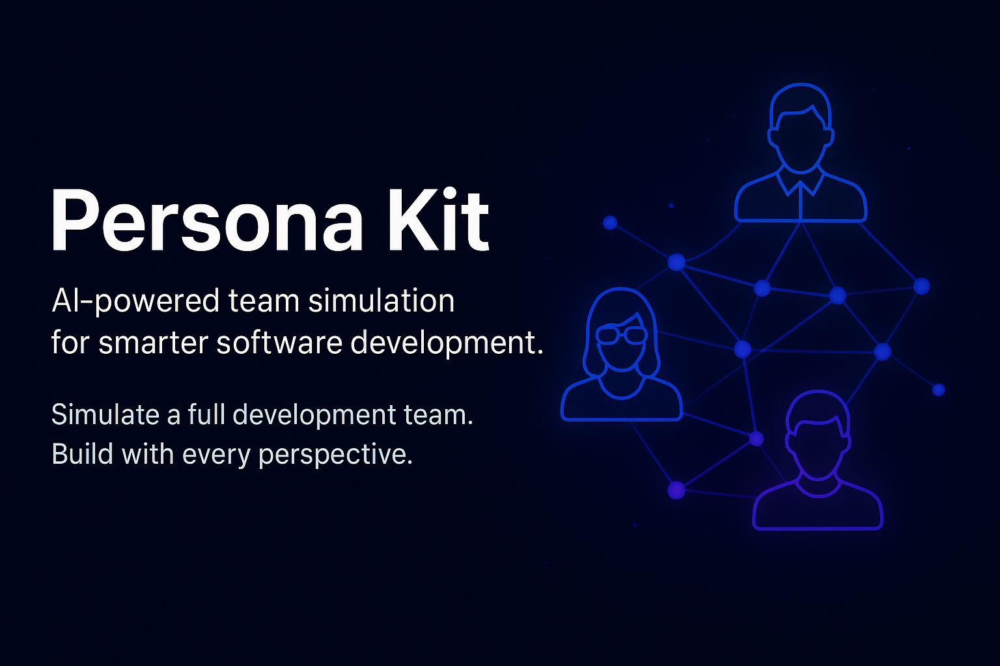

<div align="center">
    
    <h1>👥 Persona Kit</h1>
    <h3><em>Access the expertise of a full development company through AI personas.</em></h3>
</div>

<p align="center">
    <strong>Persona Kit provides AI-powered personas mimicking a full-scale development company, enabling individuals and small teams to access specialized expertise from various roles including CEO, Engineering Manager, Architect, Developer, QA, Security, and DevOps.</strong>
</p>

<p align="center">
    <a href="https://github.com/Nom-nom-hub/persona-kit/actions/workflows/release.yml"></a>
    <a href="https://github.com/Nom-nom-hub/persona-kit/stargazers"></a>
    <a href="https://github.com/Nom-nom-hub/persona-kit/blob/main/LICENSE"></a>
    <a href="https://nom-nom-hub.github.io/persona-kit/"></a>
</p>

---

## Table of Contents

- [🤔 What is Persona Kit?](#-what-is-persona-kit)
- [⚡ Get started](#-get-started)
- [👥 Available Personas](#-available-personas)
- [🤖 Supported AI Agents](#-supported-ai-agents)
- [🔧 Persona Kit CLI Reference](#-personakit-cli-reference)
- [📚 Core philosophy](#-core-philosophy)
- [🌟 Development phases](#-development-phases)
- [🎯 Experimental goals](#-experimental-goals)
- [🔧 Prerequisites](#-prerequisites)
- [📖 Learn more](#-learn-more)
- [📋 Detailed process](#-detailed-process)
- [🔍 Troubleshooting](#-troubleshooting)
- [👥 Maintainers](#-maintainers)
- [💬 Support](#-support)
- [🙏 Acknowledgements](#-acknowledgements)
- [📄 License](#-license)

## 🤔 What is Persona Kit?

Persona Kit **democratizes access to specialized development expertise** by providing AI-powered personas that simulate various roles in a large development company. Whether you need strategic guidance from a CEO persona, technical architecture advice from an Architect persona, or implementation details from a Developer persona, Persona Kit offers the perspectives of a complete development team.

This approach allows individuals and small teams to make better decisions by considering multiple viewpoints typically found only in large organizations.

## ⚡ Get started

### 1. Install Persona Kit

Choose your preferred installation method:

#### Option 1: Persistent Installation (Recommended)

Install once and use everywhere:

```bash
uv tool install personakit-cli --from git+https://github.com/Nom-nom-hub/persona-kit.git
```

Then use the tool directly:

```bash
personakit init <PROJECT_NAME>
personakit check
```

To upgrade personakit run:

```bash
uv tool install personakit-cli --force --from git+https://github.com/Nom-nom-hub/persona-kit.git
```

#### Option 2: One-time Usage

Run directly without installing:

```bash
uvx --from git+https://github.com/Nom-nom-hub/persona-kit.git personakit init <PROJECT_NAME>
```

**Benefits of persistent installation:**

- Tool stays installed and available in PATH
- No need to create shell aliases
- Better tool management with `uv tool list`, `uv tool upgrade`, `uv tool uninstall`
- Cleaner shell configuration

### 2. Establish project principles

Use the **`/personakit.constitution`** command to create your project's governing principles and development guidelines that will guide all subsequent development.

```bash
/personakit.constitution Create principles focused on code quality, testing standards, user experience consistency, and performance requirements
```

### 3. Engage with personas

Use persona commands to get specialized insights:

```bash
/personakit.personas                    # List available personas
/personakit.ceo What features should we prioritize for maximum business value?
/personakit.architect How should we structure our microservices architecture?
/personakit.developer What's the best approach to implement this specific feature?
/personakit.qa What testing strategy should we follow for this functionality?
```

### 4. Get multi-perspective insights

Combine insights from multiple personas:

```bash
/personakit.multi-perspective Analyze our proposed database schema from development, QA, and security perspectives
/personakit.role-play Simulate a team meeting to discuss the technical approach for our new feature
```

For detailed step-by-step instructions, see our [comprehensive guide](./persona-driven.md).

## 👥 Available Personas

Persona Kit provides access to AI personas representing various roles in a development company:

| Persona | Role | Expertise Area |
|---------|------|----------------|
| **CEO** | `/personakit.ceo` | Strategic business guidance, feature prioritization, market positioning |
| **Engineering Manager** | `/personakit.engineering-manager` | Team dynamics, project timelines, resource allocation |
| **Architect** | `/personakit.architect` | System design, technology selection, scalability |
| **Developer** | `/personakit.developer` | Implementation details, coding best practices |
| **QA Engineer** | `/personakit.qa` | Testing strategy, quality assurance, bug prevention |
| **Security Engineer** | `/personakit.security` | Security best practices, vulnerability assessment |
| **DevOps Engineer** | `/personakit.devops` | Deployment, infrastructure, monitoring |

## 🤖 Supported AI Agents

| Agent                                                     | Support | Notes                                             |
|-----------------------------------------------------------|---------|---------------------------------------------------|
| [Claude Code](https://www.anthropic.com/claude-code)      | ✅ |                                                   |
| [GitHub Copilot](https://code.visualstudio.com/)          | ✅ |                                                   |
| [Gemini CLI](https://github.com/google-gemini/gemini-cli) | ✅ |                                                   |
| [Cursor](https://cursor.sh/)                              | ✅ |                                                   |
| [Qwen Code](https://github.com/QwenLM/qwen-code)          | ✅ |                                                   |
| [opencode](https://opencode.ai/)                          | ✅ |                                                   |
| [Codex CLI](https://github.com/openai/codex)              | ✅ |                                                   |
| [Windsurf](https://windsurf.com/)                         | ✅ |                                                   |
| [Kilo Code](https://github.com/Kilo-Org/kilocode)         | ✅ |                                                   |
| [Auggie CLI](https://docs.augmentcode.com/cli/overview)   | ✅ |                                                   |
| [CodeBuddy](https://www.codebuddy.ai/)                    | ✅ |                                                   |
| [Roo Code](https://roocode.com/)                          | ✅ |                                                   |
| [Amazon Q Developer CLI](https://aws.amazon.com/developer/learning/q-developer-cli/) | ⚠️ | Amazon Q Developer CLI [does not support](https://github.com/aws/amazon-q-developer-cli/issues/3064) custom arguments for slash commands. |

## 🔧 Persona Kit CLI Reference

The `personakit` command supports the following options:

### Commands

| Command     | Description                                                    |
|-------------|----------------------------------------------------------------|
| `init`      | Initialize a new Persona Kit project from the latest template      |
| `check`     | Check for installed tools (`git`, `claude`, `gemini`, `code`/`code-insiders`, `cursor-agent`, `windsurf`, `qwen`, `opencode`, `codex`) |

### `personakit init` Arguments & Options

| Argument/Option        | Type     | Description                                                                  |
|------------------------|----------|------------------------------------------------------------------------------|
| `<project-name>`       | Argument | Name for your new project directory (optional if using `--here`, or use `.` for current directory) |
| `--ai`                 | Option   | AI assistant to use: `claude`, `gemini`, `copilot`, `cursor-agent`, `qwen`, `opencode`, `codex`, `windsurf`, `kilocode`, `auggie`, `roo`, `codebuddy`, or `q` |
| `--script`             | Option   | Script variant to use: `sh` (bash/zsh) or `ps` (PowerShell)                 |
| `--ignore-agent-tools` | Flag     | Skip checks for AI agent tools like Claude Code                             |
| `--no-git`             | Flag     | Skip git repository initialization                                          |
| `--here`               | Flag     | Initialize project in the current directory instead of creating a new one   |
| `--force`              | Flag     | Force merge/overwrite when initializing in current directory (skip confirmation) |
| `--skip-tls`           | Flag     | Skip SSL/TLS verification (not recommended)                                 |
| `--debug`              | Flag     | Enable detailed debug output for troubleshooting                            |
| `--github-token`       | Option   | GitHub token for API requests (or set GH_TOKEN/GITHUB_TOKEN env variable)  |

### Examples

```bash
# Basic project initialization
personakit init my-project

# Initialize with specific AI assistant
personakit init my-project --ai claude

# Initialize with Cursor support
personakit init my-project --ai cursor-agent

# Initialize with Windsurf support
personakit init my-project --ai windsurf

# Initialize with PowerShell scripts (Windows/cross-platform)
personakit init my-project --ai copilot --script ps

# Initialize in current directory
personakit init . --ai copilot
# or use the --here flag
personakit init --here --ai copilot

# Force merge into current (non-empty) directory without confirmation
personakit init . --force --ai copilot
# or 
personakit init --here --force --ai copilot

# Skip git initialization
personakit init my-project --ai gemini --no-git

# Enable debug output for troubleshooting
personakit init my-project --ai claude --debug

# Use GitHub token for API requests (helpful for corporate environments)
personakit init my-project --ai claude --github-token ghp_your_token_here

# Check system requirements
personakit check
```

### Available Slash Commands

After running `personakit init`, your AI coding agent will have access to these slash commands for persona-driven development:

#### Core Persona Commands

Essential commands for accessing different development perspectives:

| Command                  | Description                                                           |
|--------------------------|-----------------------------------------------------------------------|
| `/personakit.personas`   | List all available personas and their expertise areas                 |
| `/personakit.ceo`        | Access the CEO persona for strategic business guidance                |
| `/personakit.engineering-manager` | Get insights from an engineering manager perspective         |
| `/personakit.architect`  | Consult with a software architect persona for design decisions        |
| `/personakit.developer`  | Get hands-on development guidance from a senior developer persona     |
| `/personakit.qa`         | Access QA engineer perspective for testing strategy and quality       |
| `/personakit.security`   | Get security best practices and vulnerability considerations          |
| `/personakit.devops`     | Access DevOps perspective for deployment and infrastructure guidance  |

#### Advanced Persona Commands

Additional commands for enhanced multi-perspective development:

| Command              | Description                                                           |
|----------------------|-----------------------------------------------------------------------|
| `/personakit.multi-perspective` | Combine insights from multiple personas on a single topic     |
| `/personakit.role-play` | Simulate a team meeting with different personas providing input       |
| `/personakit.guidance-check` | Validate decisions against multiple persona viewpoints         |

### Environment Variables

| Variable         | Description                                                                                    |
|------------------|------------------------------------------------------------------------------------------------|
| `PERSONAKIT_FEATURE` | Override feature detection for non-Git repositories. Set to the feature directory name (e.g., `2024-11-15-photo-sharing`) to work on a specific feature when not using Git branches.<br/>**Must be set in the context of the agent you're working with prior to using personas or follow-up commands. |

## 📚 Core philosophy

Persona Kit is built on the philosophy of:

- **Distributed expertise**: Access specialized knowledge from multiple roles without needing a large team
- **Multi-perspective decision making**: Consider strategic, architectural, implementation, quality, security, and operational perspectives
- **AI-powered guidance**: Leverage AI to simulate the expertise of various development roles
- **Scalable mentorship**: Get guidance at the level of expertise typically found in large organizations

## 🌟 Development phases

| Phase | Focus | Key Activities |
|-------|-------|----------------|
| **0-to-1 Development** ("Greenfield") | Generate from scratch | <ul><li>Start with high-level requirements</li><li>Engage personas for strategic and technical guidance</li><li>Build production-ready applications with multi-perspective input</li></ul> |
| **Creative Exploration** | Parallel implementations | <ul><li>Explore diverse solutions with different persona inputs</li><li>Support multiple technology stacks & architectures</li><li>Experiment with UX patterns through multi-perspective feedback</li></ul> |
| **Iterative Enhancement** ("Brownfield") | Brownfield modernization | <ul><li>Add features iteratively with persona guidance</li><li>Modernize legacy systems with security and operational considerations</li><li>Adapt processes based on multi-perspective feedback</li></ul> |

## 🎯 Experimental goals

Our research and experimentation focus on:

### Expertise democratization

- Make enterprise-level development expertise accessible to individuals and small teams
- Validate the hypothesis that AI personas can effectively simulate the guidance of a large development organization

### Multi-perspective development

- Demonstrate improved decision-making when multiple viewpoints are considered
- Incorporate diverse perspectives (business, technical, quality, security, operations) into the development process

### User-centric development

- Enable small teams to consider the same breadth of concerns that large organizations address
- Support various development approaches from solo developers to small teams with different expertise gaps

## 🔧 Prerequisites

- **Linux/macOS** (or WSL2 on Windows)
- AI coding agent: [Claude Code](https://www.anthropic.com/claude-code), [GitHub Copilot](https://code.visualstudio.com/), [Gemini CLI](https://github.com/google-gemini/gemini-cli), [Cursor](https://cursor.sh/), [Qwen CLI](https://github.com/QwenLM/qwen-code), [opencode](https://opencode.ai/), [Codex CLI](https://github.com/openai/codex), [Windsurf](https://windsurf.com/), or [Amazon Q Developer CLI](https://aws.amazon.com/developer/learning/q-developer-cli/)
- [uv](https://docs.astral.sh/uv/) for package management
- [Python 3.11+](https://www.python.org/downloads/)
- [Git](https://git-scm.com/downloads)

If you encounter issues with an agent, please open an issue so we can refine the integration.

## 📖 Learn more

- **[Complete Persona-Driven Development Methodology](./persona-driven.md)** - Deep dive into the full process
- **[Detailed Walkthrough](#-detailed-process)** - Step-by-step implementation guide

---

## 📋 Detailed process

<details>
<summary>Click to expand the detailed step-by-step walkthrough</summary>

You can use the Persona Kit CLI to bootstrap your project, which will bring in the required artifacts in your environment. Run:

```bash
personakit init <project_name>
```

Or initialize in the current directory:

```bash
personakit init .
# or use the --here flag
personakit init --here
# Skip confirmation when the directory already has files
personakit init . --force
# or
personakit init --here --force
```

You will be prompted to select the AI agent you are using. You can also proactively specify it directly in the terminal:

```bash
personakit init <project_name> --ai claude
personakit init <project_name> --ai gemini
personakit init <project_name> --ai copilot

# Or in current directory:
personakit init . --ai claude
personakit init . --ai codex

# or use --here flag
personakit init --here --ai claude
personakit init --here --ai codex

# Force merge into a non-empty current directory
personakit init . --force --ai claude

# or
personakit init --here --force --ai claude
```

The CLI will check if you have Claude Code, Gemini CLI, Cursor CLI, Qwen CLI, opencode, Codex CLI, or Amazon Q Developer CLI installed. If you do not, or you prefer to get the templates without checking for the right tools, use `--ignore-agent-tools` with your command:

```bash
personakit init <project_name> --ai claude --ignore-agent-tools
```

### **STEP 1:** Establish project principles

Go to the project folder and run your AI agent. In our example, we're using `claude`.

You will know that things are configured correctly if you see the `/personakit.personas`, `/personakit.ceo`, `/personakit.architect`, `/personakit.developer`, `/personakit.qa`, `/personakit.security`, and `/personakit.devops` commands available.

The first step should be establishing your project's governing principles using the `/personakit.constitution` command. This helps ensure consistent decision-making throughout all subsequent development phases:

```text
/personakit.constitution Create principles focused on code quality, testing standards, user experience consistency, and performance requirements. Include governance for how these principles should guide technical decisions and implementation choices.
```

This step creates or updates the `.personakit/memory/constitution.md` file with your project's foundational guidelines that the AI agent will reference during persona interactions.

### **STEP 2:** Engage with personas for guidance

With your project principles established, you can now engage with various personas to get specialized guidance for your project. Different personas provide different perspectives:

- Use `/personakit.ceo` for strategic business guidance
- Use `/personakit.architect` for system design and technology decisions
- Use `/personakit.developer` for implementation details
- Use `/personakit.qa` for testing strategy
- Use `/personakit.security` for security considerations
- Use `/personakit.devops` for deployment guidance

>[!IMPORTANT]
>Engage with personas in sequence that makes sense for your needs. For major features, consider engaging CEO → Architect → Engineering Manager → Developer → QA → Security → DevOps.

### **STEP 3:** Multi-perspective analysis (optional but recommended)

For important decisions, use the multi-perspective commands to get input from multiple personas simultaneously:

```text
/personakit.multi-perspective Analyze our proposed database schema from development, QA, and security perspectives
```

### **STEP 4:** Document persona guidance

All persona guidance is automatically stored in the `personas/` directory in feature-specific subdirectories, allowing you to track the evolution of your project's design and implementation decisions.

The directory structure will look like:

```text
└── personas
    └── 2024-11-15-user-authentication  # Feature-specific directory
        ├── ceo-perspective.md
        ├── engineering-perspective.md
        ├── architecture-notes.md
        ├── development-plan.md
        ├── qa-assessment.md
        ├── security-review.md
        ├── devops-considerations.md
        └── multi-perspective-summary.md
```

</details>

---

## 🔍 Troubleshooting

### Git Credential Manager on Linux

If you're having issues with Git authentication on Linux, you can install Git Credential Manager:

```bash
#!/usr/bin/env bash
set -e
echo "Downloading Git Credential Manager v2.6.1..."
wget https://github.com/git-ecosystem/git-credential-manager/releases/download/v2.6.1/gcm-linux_amd64.2.6.1.deb
echo "Installing Git Credential Manager..."
sudo dpkg -i gcm-linux_amd64.2.6.1.deb
echo "Configuring Git to use GCM..."
git config --global credential.helper manager
echo "Cleaning up..."
rm gcm-linux_amd64.2.6.1.deb
```

## 👥 Maintainers

- Kaiden ([@Nom-nom-hub](https://github.com/Nom-nom-hub)) - Creator and maintainer of Persona Kit

## 💬 Support

For support, please open a [GitHub issue](https://github.com/github/persona-kit/issues/new). We welcome bug reports, feature requests, and questions about using Persona Kit.

## 🙏 Acknowledgements

This project is inspired by methodologies like Spec-Driven Development and aims to provide similar benefits through persona-driven approaches.

## 📄 License

This project is licensed under the terms of the MIT open source license. Please refer to the [LICENSE](./LICENSE) file for the full terms.