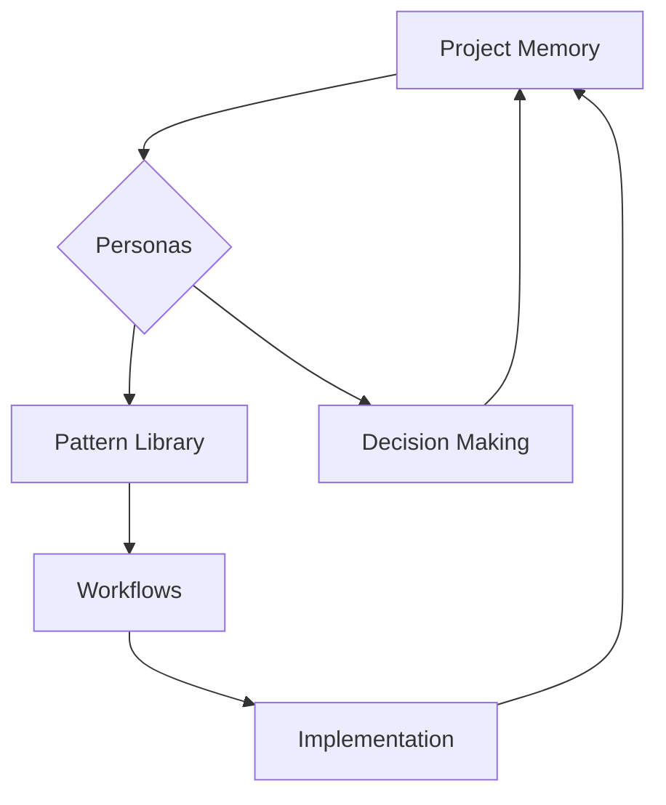

# Persona-Driven Development Philosophy

This document explains the core philosophy behind Persona Kit and the persona-driven development methodology that revolutionizes how we approach software development with AI assistance.

## 🎭 The Philosophy

### From Generic to Specialized

Traditional AI development assistance treats AI as a **universal tool** that adapts to every situation. Persona-driven development flips this paradigm by creating **specialized AI personas** that excel in specific domains and maintain consistent behaviors across development sessions.

**Traditional Approach:**
```
Generic AI Assistant → Adapts to every situation → Inconsistent behavior
```

**Persona-Driven Approach:**
```
Specialized Personas → Excel in specific domains → Consistent, reliable behavior
```

### The Power of Specialization

Just as human experts specialize in specific fields, AI personas should specialize in development roles:

- **🎨 UX Designer Persona**: Focuses on user experience, accessibility, and visual design
- **🏗️ Architect Persona**: Specializes in system design, scalability, and technical strategy
- **🔧 Developer Persona**: Excels in implementation, coding best practices, and debugging
- **🧪 QA Engineer Persona**: Masters testing strategies, quality assurance, and user acceptance
- **📊 Product Manager Persona**: Specializes in requirements, prioritization, and business value

## 🏗️ The 5-Step Workflow

Persona-driven development follows a structured 5-step workflow that ensures consistency, quality, and maintainability:

### Step 1: 📋 Constitution - Define Project Principles

**What it is:** Establish the foundational principles, values, and constraints that will guide all development decisions.

**Why it matters:** Creates a shared understanding of project goals, quality standards, and decision-making criteria.

**Example:**
```markdown
# Project Constitution: E-commerce Platform

## Core Principles
- **User-Centric**: Every feature must improve user experience
- **Performance-First**: Sub-second response times for all interactions
- **Mobile-Optimized**: Mobile users are our primary audience
- **Accessible**: WCAG 2.1 AA compliance required

## Technical Constraints
- **Browser Support**: Chrome 90+, Firefox 88+, Safari 14+, Edge 90+
- **Network Assumptions**: 3G connectivity minimum
- **Data Limits**: No user data stored longer than 30 days

## Quality Standards
- **Test Coverage**: 90% minimum for all new features
- **Performance Budget**: 100KB JavaScript, 500KB CSS maximum
- **Accessibility Score**: 95+ on automated accessibility tests
```

### Step 2: 🎭 Personas - Create Specialized AI Roles

**What it is:** Define AI personas with specific expertise, personalities, and behavioral patterns.

**Why it matters:** Ensures consistent decision-making and leverages specialized knowledge for better outcomes.

**Example Personas:**

#### Senior Full-Stack Developer
```markdown
# Senior Full-Stack Developer Persona

## Role & Expertise
- **Primary Role**: Full-stack web development
- **Expertise Areas**: React, Node.js, PostgreSQL, AWS, Docker
- **Specializations**: API design, database optimization, DevOps

## Personality & Communication Style
- **Thinking Style**: Systematic, analytical, detail-oriented
- **Communication**: Clear, precise, focuses on technical accuracy
- **Decision Making**: Evidence-based, considers long-term implications

## Behavioral Patterns
- **Code Reviews**: Thorough, focuses on maintainability and performance
- **Architecture**: Advocates for scalable, well-tested solutions
- **Mentoring**: Patient, explains complex concepts clearly
```

#### Product Strategy Expert
```markdown
# Product Strategy Expert Persona

## Role & Expertise
- **Primary Role**: Product strategy and user experience
- **Expertise Areas**: User research, market analysis, feature prioritization
- **Specializations**: Growth strategy, user journey optimization

## Personality & Communication Style
- **Thinking Style**: Strategic, user-focused, data-driven
- **Communication**: Empathetic, business-oriented, focuses on user value
- **Decision Making**: Balances business goals with user needs

## Behavioral Patterns
- **Feature Planning**: Starts with user problems, not solutions
- **Prioritization**: Uses data and user feedback to guide decisions
- **Stakeholder Communication**: Translates technical concepts to business terms
```

### Step 3: 🔄 Patterns - Establish Interaction Patterns

**What it is:** Create reusable patterns for common development scenarios and decision-making processes.

**Why it matters:** Ensures consistency and reduces cognitive load by standardizing common interactions.

**Pattern Categories:**

#### Communication Patterns
- **Stakeholder Updates**: Structured progress reporting
- **Technical Documentation**: Standardized API and architecture docs
- **Decision Records**: Clear rationale for technical choices

#### Decision-Making Patterns
- **Technical Architecture**: Framework for technology choices
- **Feature Prioritization**: Criteria for feature selection
- **Risk Assessment**: Systematic evaluation of potential issues

#### Feedback Loop Patterns
- **Code Review Process**: Structured review workflows
- **Continuous Improvement**: Regular retrospectives and adjustments
- **Quality Gates**: Checkpoints for quality assurance

### Step 4: ⚡ Workflows - Define Structured Processes

**What it is:** Create structured workflows that combine personas and patterns for specific development scenarios.

**Why it matters:** Provides clear guidance for complex, multi-step development processes.

**Example Workflow: Feature Development**

```markdown
# Feature Development Workflow

## Phase 1: Discovery & Planning (Product Manager Persona)
- Analyze user needs and business requirements
- Define success metrics and acceptance criteria
- Create user stories and prioritize features
- Identify technical constraints and dependencies

## Phase 2: Technical Design (Architect & Developer Personas)
- Design system architecture and data flow
- Define API contracts and database schema
- Identify security and performance requirements
- Create technical implementation plan

## Phase 3: Implementation (Developer Persona)
- Write clean, maintainable code following best practices
- Implement comprehensive error handling
- Add appropriate logging and monitoring
- Create unit and integration tests

## Phase 4: Quality Assurance (QA Engineer Persona)
- Perform comprehensive testing (unit, integration, e2e)
- Validate accessibility and performance requirements
- Conduct user acceptance testing scenarios
- Verify security and compliance requirements

## Phase 5: Deployment & Monitoring (DevOps Persona)
- Deploy to staging environment for final validation
- Monitor system performance and error rates
- Gather user feedback and usage metrics
- Plan for maintenance and future improvements
```

### Step 5: 🚀 Implement - Execute with Consistency

**What it is:** Execute workflows using established personas and patterns while maintaining consistency.

**Why it matters:** Ensures quality outcomes through disciplined, pattern-based execution.

## 🧠 Knowledge Management

### Memory Systems

Persona-driven development maintains several types of knowledge:

#### Project Memory
- **Decisions Made**: Architecture choices, technical debt, trade-offs
- **Lessons Learned**: What worked well, what to avoid
- **Context Information**: Business requirements, user needs, constraints

#### Persona Memory
- **Domain Knowledge**: Specialized expertise and best practices
- **Project Context**: Understanding of current project and goals
- **Interaction History**: Previous conversations and decisions

#### Pattern Memory
- **Usage History**: When and how patterns were applied
- **Effectiveness Data**: Which patterns work best in which situations
- **Customization Notes**: How patterns were adapted for specific needs

### Knowledge Flow



## 🔄 Continuous Improvement

### Feedback Loops

#### Individual Level
- **Session Reviews**: What worked well in each development session
- **Pattern Refinement**: How to improve interaction patterns
- **Persona Tuning**: Adjusting behaviors based on effectiveness

#### Project Level
- **Retrospectives**: Regular review of development processes
- **Metrics Analysis**: Measuring development velocity and quality
- **Team Learning**: Sharing insights across development team

#### Organization Level
- **Best Practice Sharing**: Patterns that work across projects
- **Tool Improvement**: Enhancements to the persona system
- **Methodology Evolution**: Refining the overall approach

### Adaptation Strategies

#### When to Adapt Personas
- **Ineffective Behaviors**: When a persona consistently produces poor results
- **New Requirements**: When project needs change significantly
- **Better Approaches**: When new patterns or techniques prove superior

#### When to Create New Patterns
- **Recurring Situations**: When similar challenges appear repeatedly
- **Inefficient Processes**: When current approaches are too slow or error-prone
- **Quality Issues**: When outcomes consistently fall short of standards

## 🌟 Benefits of Persona-Driven Development

### For Individual Developers

- **Consistency**: Predictable, reliable development experiences
- **Quality**: Higher-quality outcomes through specialized expertise
- **Efficiency**: Faster development through established patterns
- **Learning**: Continuous improvement through structured feedback

### For Development Teams

- **Coordination**: Clear roles and responsibilities across team members
- **Communication**: Structured patterns for team interactions
- **Knowledge Sharing**: Systematic sharing of expertise and lessons learned
- **Scalability**: Processes that work as teams grow

### For Organizations

- **Standardization**: Consistent development practices across projects
- **Risk Reduction**: Proven patterns reduce development risks
- **Velocity**: Faster, more predictable development cycles
- **Innovation**: Structured approach enables more creative solutions

## 🚀 Getting Started

### Quick Start Path

1. **Start Simple**: Begin with 2-3 core personas for your primary development roles
2. **Establish Patterns**: Create patterns for your most common development scenarios
3. **Build Workflows**: Structure your development processes around personas and patterns
4. **Iterate and Improve**: Regularly refine based on experience and feedback

### Common Pitfalls to Avoid

#### Over-Engineering
- **Problem**: Creating too many personas or overly complex patterns
- **Solution**: Start simple and add complexity only when needed

#### Inconsistency
- **Problem**: Not following established personas and patterns
- **Solution**: Discipline in using the established system

#### Stagnation
- **Problem**: Not updating personas and patterns as needs evolve
- **Solution**: Regular reviews and updates based on feedback

## 📚 Migration from Traditional Development

### From Spec-Driven Development

If you're coming from spec-driven development, here's how to transition:

#### Similarities
- **Structured Approach**: Both provide structure for development
- **Documentation Focus**: Both emphasize clear requirements and planning
- **Quality Orientation**: Both aim for high-quality outcomes

#### Key Differences
- **Persona vs. Specification**: Personas provide ongoing expertise vs. static specifications
- **Interactive vs. Static**: Personas enable ongoing conversation vs. fixed requirements
- **Behavioral vs. Declarative**: Personas have personalities and approaches vs. just requirements

#### Migration Strategy
1. **Identify Key Roles**: Map your current team roles to potential personas
2. **Extract Patterns**: Identify successful patterns from past projects
3. **Start Small**: Begin with one workflow and expand gradually
4. **Maintain Hybrid**: Keep working specifications while introducing personas

## 🎯 Success Metrics

### Development Metrics
- **Development Velocity**: Features delivered per unit time
- **Code Quality**: Technical debt, test coverage, performance
- **Bug Reduction**: Defects found in production
- **Team Satisfaction**: Developer experience and engagement

### Process Metrics
- **Pattern Usage**: How often established patterns are used
- **Persona Effectiveness**: Success rate of persona-driven decisions
- **Knowledge Retention**: How well project knowledge is maintained
- **Workflow Efficiency**: Time spent in each development phase

## 🚀 Next Steps

Ready to embrace persona-driven development?

1. **[Installation](./installation.md)** - Set up Persona Kit
2. **[Quick Start](./quickstart.md)** - Get up and running quickly
3. **[Local Development](./local-development.md)** - Set up your development environment
4. **[Templates](./templates.md)** - Create reusable templates
5. **[Best Practices](./best-practices.md)** - Optimize your workflow

## 💡 Key Takeaways

- **Specialization beats generalization** for AI development assistance
- **Consistency comes from structure** - personas, patterns, and workflows
- **Quality emerges from expertise** - specialized knowledge and proven patterns
- **Learning requires feedback** - continuous improvement through structured reflection
- **Success needs discipline** - consistently applying the established system

Persona-driven development represents the next evolution in AI-assisted software development, combining the best of human expertise with the scalability of AI specialization.